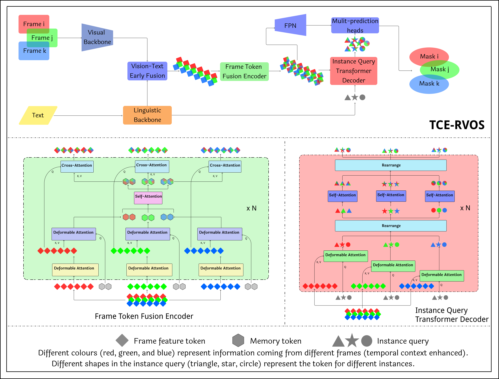

# TCE-RVOS
The official implementation for the "Temporal Context Enhanced Referring Video Object Segmentation" accepted by WACV 2024

> [Temporal Context Enhanced Referring Video Object Segmentation](https://uottawa-my.sharepoint.com/personal/xhu008_uottawa_ca/_layouts/15/guestaccess.aspx?share=EZGOLNbASdNJn-VG5EfCEmABteLVN7e2homZ9yuR0fq88w&e=S9daUf) 
Xiao Hu, Basavaraj Hampiholi, Heiko Neumann, and Jochen Lang

## Abstract
The goal of Referring Video Object Segmentation is to extract an object from a video clip based on a given expression. While previous methods have utilized the transformer's multi-modal learning capabilities to aggregate information from different modalities, they have mainly focused on spatial information and paid less attention to temporal information. To enhance the learning of temporal information, we propose TCE-RVOS with a novel frame token fusion (FTF) structure and a novel instance query transformer (IQT). Our technical innovations maximize the potential information gain of videos over single images. Our contributions also include a new classification of two widely used validation datasets for investigation of challenging cases.

## Update
- (2023/11/19) Code researsed.💥
- (2023/10/24) TCE RVOS is accepted by WACV2024.🏄

## Demo
- Videos

<video width="640" controls loop>
  <source src="/docs/demo_video.mp4" type="video/mp4">
</video>